---
aliases:
  - Lipid Management
---
# Approach to [[Hyperlipidemia]]

1. Rule out [[Hyperlipidemia#Secondary Causes of HLD Commonly Encountered|secondary causes]]
2. Assess risk: Ask 3 Questions
	1. Do you have [[ASCVD Risk Calculator|ASCVD]]?
		2. ASCVD is defined as any [[Coronary Artery Disease (CAD)|CAD]]/angina, [[Cerebral Vascular Disease|Stroke/TIA]], [[Peripheral Arterial Disease|PAD]], aortic aneurysm (all of atherosclerotic origin), or any artery revascularization.
		3. 📝 [[Coronary Artery Calcium (CAC)|CAC]] is *not* included as an ASCVD category
3. Discuss lifestyle & options
4. Initiate treatment & monitor

```mermaid
flowchart TD
    A[Is ASCVD present?] --> |Yes| B("Secondary Prevention\nGoal LDL < 55 (very high risk) or < 70")
    A --> |No| C(Primary Prevention)
    C --> D[Is LDL ≥ 190 mg/dL?]
    D --> |Yes| E([Familial Hyperlipidemia\nGoal LDL < 55/70])
    D --> |No| F[Is DM Present?]
    F --> |Yes| G([T1DM or T2DM\nGoal LDL < 55/70/100])
    F --> |No| H([No DM\nGoal LDL < 55/70/100])
```

## Very High Risk ASCVD

- **Very High Risk [[ASCVD Risk Calculator|ASCVD]]** is if patient has had ≥ 2 ASCVD events *or* (1 Event + ≥ 2 Conditions)
	- **Events**
		- Recent ACS (<12 mo)
		- MI (other than above)
		- Ischemic [[Cerebral Vascular Disease|stroke]]
		- [[Peripheral Arterial Disease|PAD]] (Claudication w/ ABI <0.85, or revascularization or amputation)
	- **Conditions**
		- Current smoker, [[Diabetes|DM]], [[Hypertension|HTN]], ≥65 years
		- LDL ≥ 100 on max statin & ezetimibe therapy
		- Heterozygous [[Familial Hyperlipidemia|FH]]
		- Prior CABG/PCI (Not major ASCVD event)
		- CKD (eGFR 15-59)
		- Hx of [[Heart Failure with Reduced Ejection Fraction (HFrEF)]]
	- 
		- Figure source: [^2022-acc]

## 'Risk Enhancers'

- [[Diabetes]] "Risk Enhancers" → if present, LDL goal < 70; if not present, then LDL goal < 100
	- Duration:
		- T2DM for 10 years
		- T1DM for 20 years
	- Ur Albumin ≥30 mcg/mg Creat
	- eGFR <60 ml/min/1.73 m2
	- Diabetic retinopathy 
	- Diabetic neuropathy 
	- ABI <0.9
- **Primary Prevention** 'Risk Enhancers'
	- History and Co-morbidities (<u>Think Inflammation</u>)
		- Fam Hx premature [[ASCVD Risk Calculator|ASCVD]]
		- Ethnicity (eg, South Asian ancestry)
		- CKD
		- [[Metabolic Syndrome]]
		- Conditions specific to women (eg, [[Pre-eclampsia]], premature menopause)
		- Inflammatory diseases (esp Rh Arthritis, psoriasis, HIV)
	- Lipids/Biomarkers
		- LDL-C ≥ 160
		- Persistently elevated TG ≥175
	- Other
		- hsCRP ≥ 2.0
		- ABI < 0.9
		- [[Lipoprotein (a)|Lp(a)]] >50 mg/dL or 125 nmol/L
			- especially if Fam Hx of premature [[ASCVD Risk Calculator]]
		- ApoB > 130 mg/dL
			- especially if TG > 200

## Secondary Causes of HLD Commonly Encountered

| Secondary Cause         | Elevated LDL-C                                                                             | Elevated TG                                                                                                                                                                                 |
| ----------------------- | ------------------------------------------------------------------------------------------ | ------------------------------------------------------------------------------------------------------------------------------------------------------------------------------------------- |
| Diet                    | Saturated fat or keto, weight gain, anorexia                                               | Weight gain, very low-fat diet, high refined carbs, excess alcohol                                                                                                                          |
| Drugs                   | [[Diuretics]], [[Amiodarone]], retinoic acid (even topical), glucocorticoids, cyclosporine | [[Beta-blockers]] (*except* carvedilol), [[Diuretics\|thiazides]], anabolic steroids, retinoic acid, oral estrogens, glucocorticoids, protease inhibitors, sirolimus, raloxifene, tamoxifen |
| Diseases                | Biliary obstruction, Nephrotic syndrome                                                    | Nephrotic syndrome, chronic renal failure, lipodystrophies                                                                                                                                  |
| Disorders of metabolism | Low T4, obesity, pregnancy                                                                 | DM (poorly controlled), Low T4, obesity, pregnancy                                                                                                                                          |

# Lifestyle Modifications

- Daily physical activity
- Weight management
- Diet: reduced intake of saturated fats (to <7% of total calories), _trans_ fatty acids (to <1% of total calories), and cholesterol (to <200 mg/d)
- Moderate- or high-intensity [[Statins|statin]]

# Pharmacotherapy

- [[Statins]]
- [[Ezetimibe]]
- [[PCSK9 Inhibitors]]
- [[Bempedoic Acid]]
- [[Inclisiran]]
- [[Omega-3]]
- [[Fibrates]]
- Others
	- Bile Acid Sequestrants (colestipol and colesevelam)
		- Limited use due to low efficacy, significant drug interactions, pill burden
	- Evinacumab
		- mAb that inhibits ANGPTL3 to promote VLDL processing and clearance upstream from LDL formation.
		- Monthly IV infusion administered by healthcare professional.
		- Only approved for HoFH although has shown benefit for other causes of hyperlipidemia
		- Robust LDL-C lowering - ~50%
	- Lomitapide
		- Inhibits synthesis of chylomicrons and VLDL, resulting in ↓ LDL-C
		- Daily tablet only approved for HoFH.
		- Robust LDL-C lowering - ~40-50%.
		- Hepatotoxicity concern - requires REMS program. Significant drug interactions

## High Intensity [[Statins]]

- Rosuvastatin 20-40 & Atorvastatin 40-80 mg
- Maximally tolerated statin still the foundation
- ↓ LDL-C ~50%
- Can get creative to identify "maximally tolerated" to manage intolerance
	- Symmetric myalgias in large proximal muscle groups may indicate true statin intolerance; RARE
		- SAMSON trial - 90% of muscle symptoms attributed to "nocebo effect"
	- Rule out/correct other causes of muscle symptoms: hypothyroidism, vitamin D deficiency, exercise
	- Hydrophilic statins potentially less muscle symptoms (rosuvastatin, pravastatin)
	- Up to 90% of initially intolerant do fine with re-challenge
		- Allow 2-4 week wash out

Variability in individual response to statins

# Primary Prevention

![[Hyperlipidemia-20240925184923066.webp]]

# Secondary Prevention

![[Hyperlipidemia-20240925184736061.webp]]

[^2022-acc]: Lloyd-Jones, D. M., Morris, P. B., Ballantyne, C. M., Birtcher, K. K., Covington, A. M., DePalma, S. M., Minissian, M. B., Orringer, C. E., Smith, S. C., Waring, A. A., & Wilkins, J. T. (2022). 2022 ACC Expert Consensus Decision Pathway on the Role of Nonstatin Therapies for LDL-Cholesterol Lowering in the Management of Atherosclerotic Cardiovascular Disease Risk. Journal of the American College of Cardiology, 80(14), 1366–1418. https://doi.org/10.1016/j.jacc.2022.07.006
[^sihd]: Fihn SD, Gardin JM, Abrams J, et al. 2012 ACCF/AHA/ACP/AATS/PCNA/SCAI/STS Guideline for the Diagnosis and Management of Patients With Stable Ischemic Heart Disease. Journal of the American College of Cardiology. 2012;60(24):e44-e164. doi:10.1016/j.jacc.2012.07.013

