---
tags:
  - pericardial
---
```text
# Pericardial effusion
- (Acute/subacute/chronic) (mild/moderate/large) (circumferential/loculated) (transudative/exudative)
- Work-up: CBC, ESR, CRP, CK, troponin, 12-lead ECG, CXR
- Imaging
	- Echo
	- CT/MR (if loculated effusion, pericardial thickening and masses, or other chest abnormalities)
- Empiric therapy for pericarditis if inflammatory signs present
```

- The normal pericardial sac contains 10--50 ml of pericardial fluid as a plasma ultrafiltrate that acts as a lubricant between the pericardial layers.
- Etiology can be broken down into one of 2 issues:
	- Increased production or accumulation
	- Decreased reabsorption

```mermaid
flowchart TD
    A[Pericardial Effusion] --> B(↑ production or accumulation)
    A --> C(↓ reabsorption)
```


  

- <u>Classification</u>
	- **Onset**
		- acute or subacute vs. chronic when lasting >3 months
	- **Distribution**
		- circumferential or loculated
	- **Hemodynamic impact**
		- none, cardiac tamponade, effusive-constrictive
	- **Composition**
		- exudate, transudate, blood, rarely air, or gas from bacterial infections
	- **Size**
		- Mild: \< 1.0 cm
		- Moderate: 1.0-2.0 cm
		- Large: \> 2.0 cm
		- 📝 Assess end-diastolic distance of the echo-free space between the epicardium and parietal pericardium: small (\<1.0 cm), moderate (1.0-2.0 cm), large (\>2.0 cm)
	- ![[Pericardial Effusion-20240924221028791.webp|449]]

  

# Patient History

- Classic symptoms include DOE progressing to orthopnoea, chest pain and/or fullness.
- Additional occasional symptoms due to **local compression** may include nausea (diaphragm), dysphagia (esophagus), hoarseness (recurrent laryngeal nerve) and hiccups (phrenic nerve).
- Non-specific symptoms include cough, weakness, fatigue, anorexia and palpitations, and reflect the compressive effect of the pericardial fluid on contiguous anatomic structures or reduced blood pressure and secondary sinus tachycardia.

# Management

![[Pericardial Effusion-20240924221456893.webp|619]]

- If inflammatory signs are present, the clinical management should be that of **[[Pericarditis|pericarditis]]**.
- **Cardiac tamponade** without inflammatory signs is associated with a higher risk of a neoplastic etiology (likelihood ratio 2.9), whereas a severe effusion *without* **cardiac tamponade** and inflammatory signs is usually associated with a chronic idiopathic etiology (likelihood ratio 20).
- If moderate/large effusion, consider bacterial or neoplastic conditions
- What do I do if <u>chronic</u> effusion without a definite etiology?
	- No data on role of NSAIDs, colchicine, steroids
- If inflammatory markers up, consider trial of NSAIDs and/or [[Colchicine|colchicine]] and/or low-dose [[Steroids|steroids]]
- In the absence of inflammation, NSAIDs, [[Colchicine|colchicine]] and [[Steroids|corticosteroids]] are generally not effective.

## Pericardiocentesis

- Indications
	- [[Pericardial Tamponade|Cardiac Tamponade]] present
	- Symptomatic moderate/large effusion unresponsive to medical therapy
	- Suspicion of unknown bacterial or neoplastic etiology
- Recurrences are common, and pericardiectomy or less invasive options (i.e. pericardial window) should be considered whenever fluid reaccumulates, becomes loculated or biopsy material is required.

  

- Follow-up

  

- Symptoms

  

- Echocardiographic size of the effusion

  

- Additional features such as inflammatory markers (i.e. CRP)