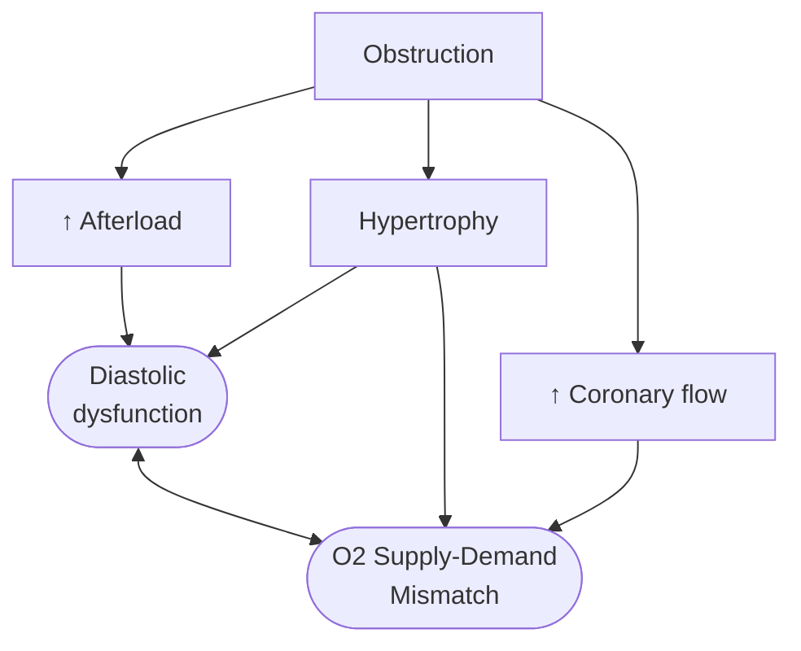

---
tags:
  - valvulardisease
---
- Related
	- [[Aortic Valve]]
	- [[Subaortic Stenosis]]
- MC mechanism is calcification/calcific degeneration
- Absence of LVH (~25%) in significant AS. So while LVH is often present, absence does not exclude severe AS.

AS is a pressure overload lesion → ↑ stress in the LV wall. To counter this increased wall stress, you will see increased LV wall thickness. Recall, $\text{stress} = \frac{\text{pressure} \times \text{radius}}{\text{thickness}}$ → ∴ ↑ wall thickness will help to reduce the increased wall stress d/t AS. The LV cavity size will remain normal, as will the LVEF. When you have [[Afterload|afterload]] mismatch (when the [[Afterload|afterload]] is way too high), then you may observe LV dilatation and ↓ EF; seen in more end-stage disease.

```mermaid
flowchart TD
    A[Obstruction] --> B[↑ Afterload]
    A --> C[Hypertrophy]
    A --> D[↑ Coronary flow]
    B --> E([Diastolic\ndysfunction])
    C --> E
    C --> F([O2 Supply-Demand\nMismatch])
    D --> F
    E <--> F
```
# Etiology

- Classified by the level of the obstruction:
	- **Valvular AS** (most common) - obstruction at the valve
	- **Supravalvular AS** - obstruction *above* the AV
	- **Subvalvular AS** (10% of pts w/ AS), e.g. [[Subaortic Stenosis]] - obstruction *below* the AV

# Valvular [[Aortic Stenosis]]

- Age-related etiology
	- <30: Congenital (unicuspid, [[Bicuspid Aortic Valve|bicuspid]])
	- 40-60: Calcified [[Bicuspid Aortic Valve|bicuspid]]
	- 40-60: [[Rheumatic Heart Disease|Rheumatic]]
	- 70+: Senile degenerative (most common)
	- ![[Aortic Stenosis-20240808141828704.webp]]

# Supravalvular [[Aortic Stenosis]]

- Level of obstruction <u>above</u> the [[Aortic Valve|aortic valve]], i.e. at the aorta
	- single discrete narrowing in the sinotubular junction or higher up in the aorta, or
	- long tubular hypoplasia
- Physical exam
	- thrill in suprastenal notch with radiation to the R carotid
	- 🌟**loud A2**
		- the [[Aortic Valve|aortic valve]] itself is normal → aortic ❤️ sound is preserved
		- important distinguishing feature in contrast to valvular AS
- Diagnosis
	- TTE and [[Echo Doppler|Doppler]]: high velocity with narrowed aorta. If present, get MRI or CT for further characterization.
- Management
	- surgical intervention may be indicated, especially if high gradient or symptomatic

# Subvalvular [[Aortic Stenosis]]

- Level of obstruction is <u>below</u> the [[Aortic Valve|aortic valve]]
	- discrete ridge, or
	- tunnel stenosis/obstruction
- Frequently associated with [[Aortic Regurgitation|AR]] b/c you have a high velocity jet that hits the [[Aortic Valve|AV]] that causes regurgitation
- Diagnosis
	- Suspect when there is a high Doppler gradient and normal AV
	- May need repeat TTE or TEE
- Management
	- Operate for complete "cure"
		- Goal: prevent progression [[Aortic Regurgitation|AR]]
		- ∴ resection indicated in most pts, especially if severe or symptomatic

# Syncope in Severe AS

Can be caused by either arrhythmia, obstruction, or due to vasodepressor effect of AS. If present, need to move fast for life-saving AVR.

# Murmur in AS

- Late-peaking systolic murmur
- **Absent A2** in <u>severe</u> AS b/c it is severely diseased and doesn't generate sound
- S4 heart sound may be heard from ↓ compliance of LV

# Low-flow, Low-gradient AS

- Observed when there is discordance in [[Echo Doppler|Doppler]] measurements, i.e. gradient < 40 mmHg and AVA < 1.0.
- Stage D2 if EF < 50%
- Stage D3 if EF ≥ 50%
- TODO
# Diagnosis
## Echo for Valvular AS

> [!tip] Board Pearl: If normal [[Aortic Valve]] on 2D-echo and *high* gradient, think **subvalvular** AS, e.g. [[Subaortic Stenosis]], or **supravalvular** AS.

- LV size and function
- Location of the stenosis
	- Cannot tell severity of stenosis with 2D-echo alone. You will need [[Echo Doppler|Doppler]] to help determine severity of AS.
	- Beware of concomitant *dynamic* LVOT obstruction
		- If dynamic LVOTO, patient will be better served with SAVR rather than TAVR. As described in [[Hypertrophic Cardiomyopathy|HCM]], you may be able to assess for <u>dynamic LVOTO</u> in the cath lab by inducing a PVC and looking out for the **Brockengrough-Braunwald-Morrow Sign**
- Concomitant mitral valve disease

![[Aortic Stenosis-20240808162332240.webp]]
###  Grading of AS

- ==Valvular AS will be considered **severe** if mean gradient > 40 mmHg *or* peak velocity > 4 m/s (regardless of AVA)==
- AVA is important, but can be difficult to determine with the [[Echo Math#Continuity Equation for Aortic Valve Area|continuity equation]], which itself is highly operator dependent
	- Use if mean gradient < 40 mmHg or peak velocity < 4 m/s

|                      | Mild AS | Moderate AS | Severe AS | Very Severe AS |
| -------------------- | ------- | ----------- | --------- | -------------- |
| AVA (cm2)            | >1.5    | 1.5-1       | <1        |                |
| Mean gradient (mmHg) | <20     | 20-40       | >40       | >60            |
| Peak velocity (m/s)  | <3      | 3-4         | >4        | >5             |
| Indexed AVA (cm2/m2) | >0.85   | 0.60-0.85   | <0.6      |                |
| Velocity ratio       | >0.50   | 0.25-0.50   | <0.25     |                |

> [!warning] Underestimation due to improper [[Echo Doppler|Doppler]] alignment across the [[Aortic Valve]]
> If not parallel to the AS jet, you will not get the highest mean AV gradient or peak velocity across the AV → underestimate severity of AS. Importantly, you cannot *overestimate* the gradient (Exceptions: significant anemia or [[Subaortic Stenosis]]).

- Doppler assessment
	- Measurements required
		- LVOT diameter (2D)
		- LVOT velocity, TVI (PW Doppler)
		- Peak AV velocity, TVI (CW Doppler)
	- **Aortic valve area (AVA)**
		- [[Echo Math#Continuity Equation for Aortic Valve Area|Continuity equation valve area]]: $\text{AVA} = \frac{\text{CSA}_{\text{LVOT}} \times \text{VTI}_{\text{LVOT}}}{\text{VTI}_{\text{AV}}}$
			- Requires 3 measurements: 
				- AS jet velocity (CW Doppler), 
				- LVOT diameter to calculate cross-sectional area (CSA), and 
				- LVOT velocity (PW Doppler)
		- ![[Aortic Stenosis-20240808142032634.webp|254]]
		- ![[Aortic Stenosis-20240808142058039.webp]]
			- The above figure is from the Mayo Echo Boards video where the presenter highlights the importance of calculating the AV TVI in multiple windows to ensure you are appropriately calculating the *highest* VTI and avoid miscalculation/miscalssification. In Thaden et al (JASE, 2015), the authors found that peak velocity was found outside of the apical window 61% of the time and that neglecting non-apical window misclassified AS 23% of the time.
		- ⚠️ Elderly patients may have vascular stenosis → elevated AV VTI measurement outside of the apex.
	- **Mean pressure gradient**
		- Bernoulli equation: $\Delta P = \sum 4v^2/N$
	- **Peak velocity** across aortic valve
		- ![[Aortic Stenosis-20240808162556364.webp]]

![[Aortic Stenosis-20240808142239483.webp]]

## Cardiac Catheterization for Grading AS severity

- Gorlin equation should be avoided b/c it is 1) complicated and 2) mistakes are easy
- 🌟 **Hakki equation** should be used

$$
\text{AVA} = \frac{\text{Cardiac Output}}{\sqrt{\text{Peak-to-Peak gradient}}}
$$
# [[Dobutamine Stress Echocardiography]] in [[Aortic Stenosis#Low-flow, Low-gradient AS|low-flow, low-gradient AS]]

- DSE is recommended in patients with low-flow, low-gradient AS to determine AS severity
	- ?Only D2 to differentiate severe and pseudosevere right?
- DSE is not completely without risks because it may induce or aggravate arrhythmias and cause worsening of mitral regurgitation, especially in patients with advanced cardiomyopathies. [^adrichem]

## Cardiac CT and [[Coronary Artery Calcification]] Score in AS

- The degree of aortic valve calcification (AVC) correlates with AS severity according to current European and American guidelines.
- Agatston threshold for severe AS is ≥ 2,000 AU for men and ≥ 1200 AU for women.[^adrichem]  (FYI, I've also seen 1,300 used as threshold in women)
- [^adrichem] point out that the above thresholds were defined using AS defined with predominantly concordant AS Echo measurements, which isn't the case in low-flow, low-gradient (Stage D) AS. In their study, [^adrichem] find that CAC scores had poor discrimination between AS severity, so probably worth sticking to [[Dobutamine Stress Echocardiography|DSE]] for these patients.
# Congenital Aortic Valve Malformations

> [!NOTE] Congenital AV and aortic aortopathy
> When you have a congenital aortic valve malformation, you will often find an associated aortic dilatation or aortopathy.

## Unicuspid AV

- Fatal aortic stenosis in children under 1 year 
- Rare in adults ~0.02%
- Uni- or acommissural (a membrane with a hole in it)
	- ![[Aortic Stenosis-20240808142258822.webp|404]]
- Causes aortic stenosis
- Associated with aorta dilatation/aortopathy

## Quadricuspid aortic valve

- No gender preference
- [[Aortic Regurgitation|Aortic regurgitation]] > [[Aortic Stenosis|Aortic stenosis]]
- Cusps may be unequal → [[Aortic Regurgitation|AR]]
- Anomalous coronary arteries 10%
- Pulmonary stenosis, [[Hypertrophic Cardiomyopathy|HCM]], Subaortic stenosis, [[Ventricular Septal Defect (VSD)|VSD]]
- Aorta dilatation

## AS in [[Bicuspid Aortic Valve]]

- 1-2% of general population
- From fusion of two cusps
- Aortic stenosis or [[Aortic Regurgitation]]
- Infective endocarditis
- Associated with aortopathy
	- Sinus of Valsalva dilatation (can be symmetric or asymmetric)
	- Ascending aorta dilatation
	- Aortic coarctation
- Familial
	- Recommend screening of first-degree relatives
- Most common form is fusion of RCC and LCC ("raphe")
- CW Doppler from Suprasternal Notch view looking at the descending aorta: **Sawtooth pattern**
	- Severe coarctation is characterized by accelerated flow velocities both in systole and diastole resulting in a sawtooth flow pattern
	- ![[Aortic Stenosis-20240808142427194.webp|347]]

[^adrichem]: Adrichem, R., Hokken, T. W., Bouwmeester, S., Abdelkarim, O., Vogel, B., Blusztein, D. I., Veulemans, V., Kuneman, J. H., Geleijnse, M. L., Verhemel, S., Van den Dorpel, M. M. P., Kardys, I., Tonino, P. A. L., Chang, S. M., Faza, N. N., Jou, S., Ueyama, H. A., Bartkowiak, J., Zeus, T., … Van Mieghem, N. M. (2024). Diagnostic Value of Aortic Valve Calcification Levels in the Assessment of Low-Gradient Aortic Stenosis. JACC: Cardiovascular Imaging, 17(8), 847–860. https://doi.org/10.1016/j.jcmg.2024.03.014
