---
tags:
  - valvulardisease
---
- Related
	- [[Aortic Valve]]
	- [[Subaortic Stenosis]]
- MC mechanism is calcification/calcific degeneration
- In a patient with <u>severe AS</u>, Skolnick asks **"Is the patient safe enough to return for follow-up in 6-12 months?"**
	- It is important to make sure that the patient is truly ASx before saying, "I'll see you again in 6 months."
	- Recognize that the classic Sx (angina, dyspnea, fatigue, syncope, etc.) are <u>LATE</u> manifestations.
	- AS progression is variable and unpredictable
- We measure gradients *at rest*, but often patients will complain of Sx with activity
- Absence of LVH (~25%) in significant AS. So while LVH is often present, absence does not exclude severe AS.

AS is a pressure overload lesion → ↑ stress in the LV wall. To counter this increased wall stress, you will see increased LV wall thickness. Recall, $\text{stress} = \frac{\text{pressure} \times \text{radius}}{\text{thickness}}$ → ∴ ↑ wall thickness will help to reduce the increased wall stress d/t AS. The LV cavity size will remain normal, as will the LVEF. When you have [[Afterload|afterload]] mismatch (when the [[Afterload|afterload]] is way too high), then you may observe LV dilatation and ↓ EF; seen in more end-stage disease.

```mermaid
flowchart TD
    A[Obstruction] --> B[↑ Afterload]
    A --> C[Hypertrophy]
    A --> D[↑ Coronary flow]
    B --> E([Diastolic\ndysfunction])
    C --> E
    C --> F([O2 Supply-Demand\nMismatch])
    D --> F
    E <--> F
```



The following figure illustrates the interplay of factors that influence myocardial remodeling in AS. Interestingly, early on you have worsening diastolic function (and global longitudinal strain), ↑ LVH (compensatory ↑ in LV mass), but flat/unchanged LVEF. "Eventually focal, irreversible scars develop which accumulate subendocardially and eventually lead to overt systolic impairment and development of symptoms. Both are Class I indications for aortic valve replacement (AVR). The impetus for finding biomarkers to time earlier AVR is that the presence of irreversible scar results in residual risk of heart failure, arrhythmia and death even after successful AVR." [^triebel]
![[Aortic Stenosis-20240809184409488.webp|548]]

# Etiology

- Classified by the level of the obstruction:
	- **Valvular AS** (most common) - obstruction at the valve
	- **Supravalvular AS** - obstruction *above* the AV
	- **Subvalvular AS** (10% of pts w/ AS), e.g. [[Subaortic Stenosis]] - obstruction *below* the AV

![[Aortic Stenosis-20240923205330480.webp]]
Figure source: Figure 15.20 from G. Ottaviani, L.M. Buja, in [Cardiovascular Pathology (Fourth Edition)](https://www.sciencedirect.com/book/9780124202191/cardiovascular-pathology), 2016
# Valvular [[Aortic Stenosis]]

> "Today's AS phenotype is a patient with [[Hypertension|hypertension]] and/or atherosclerotic disease" and AS is not just a valve disease, but is a "systemic" disease

\- David Skolnick, August 9, 2024

- Age-related etiology
	- <30: Congenital (unicuspid, [[Bicuspid Aortic Valve|bicuspid]])
	- 40-60: Calcified [[Bicuspid Aortic Valve|bicuspid]]
	- 40-60: [[Rheumatic Heart Disease|Rheumatic]]
	- 70+: Senile degenerative (most common)
	- ![[Aortic Stenosis-20240808141828704.webp]]

# Supravalvular [[Aortic Stenosis]]

- Level of obstruction <u>above</u> the [[Aortic Valve|aortic valve]], i.e. at the aorta
	- single discrete narrowing in the sinotubular junction or higher up in the aorta, or
	- long tubular hypoplasia
- Physical exam
	- thrill in suprastenal notch with radiation to the R carotid
	- 🌟**loud A2**
		- the [[Aortic Valve|aortic valve]] itself is normal → aortic ❤️ sound is preserved
		- important distinguishing feature in contrast to valvular AS
- Diagnosis
	- TTE and [[Echo Doppler|Doppler]]: high velocity with narrowed aorta. If present, get MRI or CT for further characterization.
- Management
	- surgical intervention may be indicated, especially if high gradient or symptomatic

# Subvalvular [[Aortic Stenosis]]

- Level of obstruction is <u>below</u> the [[Aortic Valve|aortic valve]]
	- discrete ridge, or
	- tunnel stenosis/obstruction
- Frequently associated with [[Aortic Regurgitation|AR]] b/c you have a high velocity jet that hits the [[Aortic Valve|AV]] that causes regurgitation
- Diagnosis
	- Suspect when there is a high Doppler gradient and normal AV
	- May need repeat TTE or TEE
- Management
	- Operate for complete "cure"
		- Goal: prevent progression [[Aortic Regurgitation|AR]]
		- ∴ resection indicated in most pts, especially if severe or symptomatic

# Hemodynamics of AS

## Transvalvular Pressure Gradient

![[Aortic Stenosis-20240922213813640.webp]]

## Normal Heart Hemodynamics
In the normal heart, when the LV starts to squeeze during systole, it generates a pressure that easily plops open the [[Aortic Valve|aortic valve]] when the pressure in the LV meets the pressure in the aorta. When this occurs, the LV and the aorta become so in love that they share the *same pressure* 🫂 until the LV relaxes and the aortic valve closes, and the romance between the LV and aorta abruptly ends until the next cardiac cycle. ==∴, in the *normal* situation, the systolic pressure in the LV is the same as the aortic pressure during systole, and there is <u>no pressure gradient</u>.== [^cn001]

## Aortic Stenosis Hemodynamics


> [!warning] Don't be fooled by **high-flow** states
> Gradients and velocities may ↑ in high flow states and not actually reflect a truly severe aortic valve stenosis. Examples of conditions associated with high-output heart failure include anemia, thyrotoxicosis, sepsis or other distributive states, AV fistulas and Paget's disease.


**Gradients**

In aortic stenosis, picture a soda bottle with a tiny pinhole through the cap. Now, during systole,
 when we're trying to squeeze soda out of the bottle (the LV in this example), you really need to generate a lot of pressure to get that small amount of volume out of the pinhole. This creates a massive pressure gradient between the LV and the aorta, which normally does not exist. If you think about it, this is a setup for a real problem. Because a peak gradient of 64 mmHg means that in order for your aortic pressure to be just 120 mmHg, i.e. a normal SBP of 120, the LV has to be 120 + 64 mmHg = 184! [^cn001]
 ∴ if you have a [[Hypertension|hypertensive patient]], for example, who also has aortic stenosis with a systemic systolic blood pressure of 160 mmHg,  then their left ventricle would have the burden of generating a systolic pressure of 160 + 64, i.e. 224 mmHg with each and every heartbeat! 😱

**Pressures**

When the valve is tight, the velocity of the blood going through the valve must increase to keep the flow through the [[Left Ventricular Outflow Tract (LVOT)|LVOT]] and the [[Aortic Valve|aortic valve]] constant. Recall, $\text{Flow rate} = \text{Area} \times \text{Velocity}$, so the velocity has to ↑ when the area is ↓ to maintain the flow rate. Analogy: Think of crimping the water hose while you're watering your plants.
We use the **modified Bernoulli equation** ($\Delta P = 4 \cdot V^2$) to convert the Doppler velocity to pressure gradients across the [[Aortic Valve|AV]]. So as the blood shoots through that tight aortic valve and we clock a velocity of 4 m/s using Doppler on echo,  we can convert that to a peak gradient of 64 mmHg, which raises our concern that that poor ventricle is working way too hard.

# Ventricular Remodeling with AS

## Initial: Compensatory Concentric LV Hypetrophy

**Compensatory concentric LVH that is adaptive to ↑ afterload**
The increased gradient that is needed with AS as [[Aortic Stenosis#Aortic Stenosis Hemodynamics|discussed above]] initially leads to first to **adaptive remodeling of the LV** as the LV tries to deal with all the stress of this ↑ afterload. Recall that wall stress by the **law of Laplace** is proportional to the ventricular systolic pressure times the chamber radius, divided by 2 times LV wall thickness.

$$
\text{Wall Tension } (T) = \frac{\text{Transmural Pressure} \times \text{Radius}}{2 \cdot \text{Wall Thickness } (t)} 
$$

**How does the LV deal with the increased stress of increased pressure?** It increases wall thickness. The analogy being lifting weights leads to ↑ muscle mass 💪. There are more parallel muscle fibers and really more parallel sarcomere units to work together to get to that whopping systolic blood pressure so that each individual unit experiences *less* tension. This is also what happens in patients with [[Hypertension|systemic hypertension]], which is really just increased pressure for the LV to pump against.
 
![[Aortic Stenosis-20240922215206567.webp]]

## Progressive: Fibrosis, LV Dilatation, and Progressive Eccentric Hypetrophy

Over time, these changes become maladaptive as fibrosis accumulates and the LV dilates with progressive eccentric hypertrophy. The LV ultimately fails with systolic dysfunction and downstream effects like [[Mitral Regurgitation#Secondary Mitral Regurgitation|functional MR]], [[Pulmonary Hypertension|pulmonary hypertension]] and [[Right Heart Failure|RV dysfunction]].

# Severe AS


> [!hint] 1, 4, 40, and 64
> AVA < 1.0 cm2
> Peak velocity > 4 m/s
> Mean gradient > 40 mmHg
> Peak gradient > 64 mmHg

In severe aortic stenosis, you have <u>two issues</u> going on:
1. A **structural** problem *and* 
	1. small valve area: the [[Aortic Valve|AV]] is tight and doesn't open up properly → quantify the **aortic valve area (AVA)**
2. A **hemodynamic consequence** of that structural problem
	1. the ↑ mean and peak gradients needed to get blood through that tight valve (See [[Aortic Stenosis#Hemodynamics of AS|Hemodynamics of AS]]) →
		1. Initial: adaptive remodeling of the LV as the LV tries to deal with all the stress of this ↑ afterload
**Recap**: You have a structural problem is that the aortic valve area is tight. That leads to a [[Aortic Stenosis#Aortic Stenosis Hemodynamics|hemodynamic consequence]] of an elevated pressure gradient, which then translates to [[Aortic Stenosis#Ventricular Remodeling with AS|increased wall stress]] on the left ventricle. This then leads to left ventricular remodeling over time and other gnarly long-term downstream consequences like [[Heart Failure with Reduced Ejection Fraction (HFrEF)|left]] and [[Right Heart Failure|right heart failure]], [[Pulmonary Hypertension|pulmonary hypertension]], and [[Mitral Regurgitation#Secondary Mitral Regurgitation|functional MR]].


- In up to 40% of patients, resting echocardiographic assessment of aortic stenosis severity is discordant, leading to clinical uncertainty.[^pawade]
- Resources
	- 📄Barnhart, G. R., Martin, R. P., Thomas, J. D., & McCarthy, P. M. (2020). The Need for Echocardiography Alerts for Aortic Stenosis: The Time Has Come. Journal of the American Society of Echocardiography, 33(3), 355–357. https://doi.org/10.1016/j.echo.2019.11.005

# Syncope in Severe AS

Can be caused by either arrhythmia, obstruction, or due to vasodepressor effect of AS. If present, need to move fast for life-saving AVR.

# Murmur in AS

- Late-peaking systolic murmur
- **Absent A2** in <u>severe</u> AS b/c it is severely diseased and doesn't generate sound
- S4 heart sound may be heard from ↓ compliance of LV

# Low-flow, Low-gradient AS


> [!tip] Measurement accuracy is key 🔑
> AVA and the peak velocity and gradients are measured in different ways. The AVA is derived from the [[Echo Math#Continuity Equation for Aortic Valve Area|continuity equation]], which relies heavily on the [[Left Ventricular Outflow Tract (LVOT)|LVOT]] diameter. A small measurement error can grossly underestimate the AVA. Peak velocity and gradients are derived from [[Echo Doppler|Doppler]] measurements through the [[Aortic Valve|aortic valve]] and may represent the true stenosis status of our patients. If all of these measurements are legit, we can start thinking about low flow, low gradient aortic stenosis.[^cn001]

- Observed when there is discordance in [[Echo Doppler|Doppler]] measurements, i.e. gradient < 40 mmHg and AVA < 1.0 cm2.
- Low-flow is defined by a [[Stroke Volume]] Index (SVI) < 35 mL/m2
- Comes in 2 flavors:
	- **Stage D2**, i.e. LFLG AS with reduced LVEF (EF < 50%)
		- low-dose [[Dobutamine Stress Echocardiography|dobutamine stress]] testing to further define severity and assess contractile reserve. (Class 2a)
		- 🤔 a crappy ventricle (e.g. EF of 5%) will not be able to generate enough power to  create serious systolic pressures → ∴ unable to generate adequate flow across the stenotic [[Aortic Valve|aortic valve]].
	- **Stage D3** (*paradoxical* LFLG AS), i.e. LFLG AS with preserved LVEF (EF ≥ 50%), but with a low [[Stroke Volume|stroke volume]]
		- optimization of blood pressure control is recommended before measurement of AS severity by TTE, TEE, cardiac catheterization, or CMR. (Class I)
		- 🤔 while the EF is "preserved," the ❤️ has limited [[Stroke Volume|stroke volume]] (e.g., infiltrative cardiomyopathy like [[content/Amyloidosis|amyloidosis]] or *severely* [[Left Ventricular Hypertrophy|hypertrophied left ventricles]]). Think about these situations where the volume in the LV at the end diastole is incredibly low. So even if the EF is "preserved," the actual amount of blood ejected through the ventricle cannot be substantial given the small amount of volume starting off in the LV prior to systole.
- In both Stage D2 and D3, the valve can be super tight, but if the ventricle cannot generate enough pressure, a gradient will not be as high as it would have been if the ventricle had adequate squeeze.[^cn001]
- If suspecting LFLG AS, calculate the **dimensionless index (DI)** (ratio ≤ 0.25 consistent with *severe* AS), which is calculated either:
	- using spectral Doppler to access the LV outflow tract to transaortic velocity ratio or 
	- the LV outflow tract to transaortic valve velocity-time integral (more reliable method)
- Additional testing [^2020-accaha]
	- LFLG AS
		- Calculate ratio of [[Left Ventricular Outflow Tract (LVOT)|LVOT]] velocity to aortic velocity to further define severity (Class 2a)
			- A normal ratio is close to 1.0, whereas a ratio of ≤0.25 corresponds to a valve area 25% of normal for that patient, which is consistent with severe AS and is a predictor of symptom onset and adverse outcomes. [^2020-accaha]
		- Measure [[Aortic Valve|AV]] calcium score by CT imaging to further define severity (Class 2a)
			- Sex-specific Agaston unit thresholds for diagnosis of severe AS are 1300 in women and 2000 in men. [^2020-accaha]

$$
\text{Velocity Ratio} = \frac{V_{\text{LVOT}}}{V_{AV}}
$$

- Stage D2 if EF < 50%
- Stage D3 if EF ≥ 50%
- TODO

![[Aortic Stenosis-20240920194206117.webp]]
# Diagnosis

## Physical Exam

Clues to *severe* AS
- Delayed carotid upstroke (Pulsus parvus et tardus)
	- LV has a hard time generating outward flow across a very tight valve → you can imagine that the flow will overall be diminished with a reduced stroke volume, and ∴ you can expect a delay in flow from the apex to the carotid artery (apical carotid delay) or from the brachial to the radial artery (brachioradial delay)
- Sustained apical impulse
- Late peaking murmur
- Absent (or diminished) S2 heart sound
	- because the valves and the leaflets are so calcified they're inflexible, and so they just close with less vigor

## Stages of AS Severity

- **Stage A** are those patients who are at risk for aortic stenosis, like they have aortic sclerosis or thickening of the aortic valve or [[Rheumatic Heart Disease|rheumatic heart disease]] or prior radiation.
	- 🔑 these patients do *not* have a hemodynamic problem or valve tight enough to cause issues (yet)
- **Stage B** is the <u>progressive</u> stage, including both **mild** and **moderate** aortic stenosis
- **Stage C** denotes *asymptomatic* **severe** aortic stenosis
	- **C1**: preserved EF
	- **C2**: reduced EF
- Stage D is *Sx* **severe** aortic stenosis

| Stage | Definition                                                                                                                           | Valve Anatomy                                                                                                                                                                                                                            | Valve Hemodynamics                                                                                                                                                                                                 | Hemodynamic Consequences                                                                                                            | Symptoms                                                                                                             |
| ----- | ------------------------------------------------------------------------------------------------------------------------------------ | ---------------------------------------------------------------------------------------------------------------------------------------------------------------------------------------------------------------------------------------- | ------------------------------------------------------------------------------------------------------------------------------------------------------------------------------------------------------------------ | ----------------------------------------------------------------------------------------------------------------------------------- | -------------------------------------------------------------------------------------------------------------------- |
| A     | At risk of AS                                                                                                                        | [[Bicuspid Aortic Valve\|BAV]] (or other congenital valve anomaly)  <br>Aortic valve sclerosis                                                                                                                                           | Aortic Vmax <2 m/s with normal leaflet motion                                                                                                                                                                      | None                                                                                                                                | None                                                                                                                 |
| B     | Progressive AS                                                                                                                       | Mild to moderate leaflet calcification/fibrosis of a [[Bicuspid Aortic Valve\|bicuspid]] or trileaflet valve with some reduction in systolic motion or  <br>[[Rheumatic Heart Disease\|Rheumatic valve changes]] with commissural fusion | Mild AS: aortic Vmax 2.0–2.9 m/s or mean ΔP <20 mm Hg  <br>Moderate AS: aortic Vmax 3.0–3.9 m/s or mean ΔP 20–39 mm Hg                                                                                             | Early LV diastolic dysfunction may be present  <br>Normal LVEF                                                                      | None                                                                                                                 |
| C1    | Asymptomatic severe AS                                                                                                               | Severe leaflet calcification/fibrosis or congenital stenosis with severely reduced leaflet opening                                                                                                                                       | Aortic Vmax ≥4 m/s or mean ΔP ≥40 mm Hg  <br>AVA typically is ≤1.0 cm2 (or AVAi 0.6 cm2/m2) but not required to define severe AS  <br>Very severe AS is an aortic Vmax ≥5 m/s or mean P ≥60 mm Hg                  | LV diastolic dysfunction  <br>Mild LV hypertrophy  <br>Normal LVEF                                                                  | None  <br>Exercise testing is reasonable to confirm symptom status                                                   |
| C2    | Asymptomatic severe AS with LV systolic dysfunction                                                                                  | Severe leaflet calcification/fibrosis or congenital stenosis with severely reduced leaflet opening                                                                                                                                       | Aortic Vmax ≥4 m/s or mean ΔP ≥40 mm Hg  <br>AVA typically ≤1.0 cm2 (or AVAi 0.6 cm2/m2) but not required to define severe AS                                                                                      | LVEF <50%                                                                                                                           | None                                                                                                                 |
| D1    | Symptomatic severe high-gradient AS                                                                                                  | Severe leaflet calcification/fibrosis or congenital stenosis with severely reduced leaflet opening                                                                                                                                       | Aortic Vmax ≥4 m/s or mean ΔP ≥40 mm Hg  <br>AVA typically ≤1.0 cm2 (or AVAi ≤0.6 cm2/m2) but may be larger with mixed AS/AR                                                                                       | LV diastolic dysfunction  <br>LV hypertrophy  <br>Pulmonary hypertension may be present                                             | Exertional dyspnea, decreased exercise tolerance, or HF  <br>Exertional angina  <br>Exertional syncope or presyncope |
| D2    | Symptomatic severe [[Aortic Stenosis#Low-flow, Low-gradient AS\|low-flow, low-gradient AS]] with reduced LVEF                        | Severe leaflet calcification/fibrosis with severely reduced leaflet motion                                                                                                                                                               | AVA ≤1.0 cm2 with resting aortic Vmax <4 m/s or mean ΔP <40 mm Hg  <br>Dobutamine stress echocardiography shows AVA <1.0 cm2 with Vmax ≥4 m/s at any flow rate                                                     | LV diastolic dysfunction  <br>LV hypertrophy  <br>LVEF <50%                                                                         | HF  <br>Angina  <br>Syncope or presyncope                                                                            |
| D3    | Symptomatic severe [[Aortic Stenosis#Low-flow, Low-gradient AS\|low-gradient AS with normal LVEF or paradoxical low-flow severe AS]] | Severe leaflet calcification/fibrosis with severely reduced leaflet motion                                                                                                                                                               | AVA ≤1.0 cm2 (indexed AVA ≤0.6 cm2/m2) with an aortic Vmax <4 m/s or mean ΔP <40 mm Hg  <br>AND  <br>Stroke volume index <35 mL/m2  <br>Measured when patient is normotensive (systolic blood pressure <140 mm Hg) | Increased LV relative wall thickness  <br>Small LV chamber with low stroke volume  <br>Restrictive diastolic filling  <br>LVEF ≥50% | HF  <br>Angina  <br>Syncope or presyncope                                                                            |

## Echo for Valvular AS


> [!tip] Board Pearl: If normal [[Aortic Valve]] on 2D-echo and *high* gradient, think **subvalvular** AS, e.g. [[Subaortic Stenosis]], or **supravalvular** AS.

- ⚠️ Measurements of AS severity made when the patient is hypertensive may underestimate or, less often, overestimate stenosis severity.[^2020-accaha]
	- Systemic hypertension imposes a second pressure load on the LV, in addition to valve obstruction → ↓ forward stroke volume and lower transaortic pressure gradient than when the patient is normotensive. 
	- If results indicate only moderate stenosis but were recorded when the patient was hypertensive, repeat measurements when the blood pressure is better controlled ensure that a diagnosis of severe AS is not missed.
- LV size and function is important! See [[Aortic Stenosis#Aortic Stenosis Hemodynamics|above]] for stages of LV involvement d/t AS.
	- Also pay attention to concurrent valvular lesions (risk of [[Mitral Regurgitation#Secondary Mitral Regurgitation|functional MR]]), pulmonary pressures (d/t risk of [[Pulmonary Hypertension|pulmonary hypertension]]), , and the right side (risk of [[Right Heart Failure|RV dysfunction]]).
- Location of the stenosis
	- Cannot tell severity of stenosis with 2D-echo alone. You will need [[Echo Doppler|Doppler]] to help determine severity of AS.
	- Beware of concomitant *dynamic* LVOT obstruction
		- If dynamic LVOTO, patient will be better served with SAVR rather than TAVR. As described in [[Hypertrophic Cardiomyopathy|HCM]], you may be able to assess for <u>dynamic LVOTO</u> in the cath lab by inducing a PVC and looking out for the **Brockengrough-Braunwald-Morrow Sign**
- Concomitant mitral valve disease

![[Aortic Stenosis-20240808162332240.webp]]
###  Grading of AS

![[Aortic Stenosis-20240923203908921.webp]]
Source: Figure 8 of [2017 ASE Valve Guidelines](https://www.asecho.org/wp-content/uploads/2017/04/2017ValveStenosisGuideline.pdf)

- ==Valvular AS will be considered **severe** if mean gradient > 40 mmHg *or* peak velocity > 4 m/s (regardless of AVA)==
	- ⚠️ With <u>mixed</u> aortic valve disease, significant AR can increase peak aortic valve velocity and mean aortic valve gradients because of high flow.
	- ⚠️ Valve area typically is ≤1 cm2 with severe AS but may be larger with 1) mixed stenosis and regurgitation or 2) in patients with a large body habitus.
- **Aortic velocity** is measured using [[Continuous Wave Doppler|continuous-wave doppler]] ultrasound with examination from multiple acoustic windows
- **Mean gradient** is calculated by averaging instantaneous gradients over the systolic ejection period using the modified Bernoulli equation, $\Delta P = 4V^2$
- AVA is important, but can be difficult to determine with the [[Echo Math#Continuity Equation for Aortic Valve Area|continuity equation]], which itself is highly operator dependent
	- Use if mean gradient < 40 mmHg or peak velocity < 4 m/s

|                      | Aortic sclerosis | Mild AS | Moderate AS | Severe AS | Very Severe AS |
| -------------------- | ---------------- | ------- | ----------- | --------- | -------------- |
| AVA (cm2)            | -                | >1.5    | >1.0-1.5    | ≤1.0      | ≤0.60          |
| Mean gradient (mmHg) | -                | <20     | 20-40       | >40       | >60            |
| Peak velocity (m/s)  | <2.0 m/s         | 2.0-2.9 | 3.0-3.9     | ≥4.0      | ≥5.0           |
| Indexed AVA (cm2/m2) |                  | >0.85   | >0.60-0.85  | ≤0.6      |                |
| Velocity ratio       |                  | >0.50   | >0.25-0.50  | ≤0.25     |                |

> [!warning] Underestimation due to improper [[Echo Doppler|Doppler]] alignment across the [[Aortic Valve]]
> If not parallel to the AS jet, you will not get the highest mean AV gradient or peak velocity across the AV → underestimate severity of AS. Importantly, you cannot *overestimate* the gradient (Exceptions: significant anemia or [[Subaortic Stenosis]]).


- Doppler assessment
	- Measurements required
		- LVOT diameter (2D)
		- LVOT velocity, TVI (PW Doppler)
		- Peak AV velocity, TVI (CW Doppler)
	- **Aortic valve area (AVA)**
		- [[Echo Math#Continuity Equation for Aortic Valve Area|Continuity equation valve area]]: $\text{AVA} = \frac{\text{CSA}_{\text{LVOT}} \times \text{VTI}_{\text{LVOT}}}{\text{VTI}_{\text{AV}}}$
			- Requires 3 measurements: 
				- AS jet velocity (CW Doppler), 
				- LVOT diameter to calculate cross-sectional area (CSA), and 
				- LVOT velocity (PW Doppler)
		- ![[Aortic Stenosis-20240808142032634.webp|254]]
		- ![[Aortic Stenosis-20240808142058039.webp]]
			- The above figure is from the Mayo Echo Boards video where the presenter highlights the importance of calculating the AV TVI in multiple windows to ensure you are appropriately calculating the *highest* VTI and avoid miscalculation/miscalssification. In Thaden et al (JASE, 2015), the authors found that peak velocity was found outside of the apical window 61% of the time and that neglecting non-apical window misclassified AS 23% of the time.
		- ⚠️ Elderly patients may have vascular stenosis → elevated AV VTI measurement outside of the apex.
	- **Mean pressure gradient**
		- Bernoulli equation: $\Delta P = \sum 4v^2/N$
	- **Peak velocity** across aortic valve
		- ![[Aortic Stenosis-20240808162556364.webp]]


![[Aortic Stenosis-20240808142239483.webp]]


## Cardiac Catheterization for Grading AS severity

- Gorlin equation should be avoided b/c it is 1) complicated and 2) mistakes are easy
- 🌟 **Hakki equation** should be used

$$
\text{AVA} = \frac{\text{Cardiac Output}}{\sqrt{\text{Peak-to-Peak gradient}}}
$$
## Treadmill exercise testing

- If the patient is <u>asymptomatic</u> with severe AS (stage C1), then assess with a simple treadmill exercise test.
	- If s/he develops Sx with exercise testing, then Class 1 indication for aortic valve replacement (AVR)
	- if s/he is noted to have decreased exercise tolerance (normalized for age/sex) *or* a fall in systolic BP >10 mm Hg from baseline to peak exercise, AVR would be reasonable (Class 2a)
- "In a subset of asymptomatic patients with severe AS, exercise testing can provide additional diagnostic and prognostic information, but it should not be performed in symptomatic patients with severe AS." [^2020-accaha]

## [[Dobutamine Stress Echocardiography]] in [[Aortic Stenosis#Low-flow, Low-gradient AS|low-flow, low-gradient AS]]

- In patients with **Stage D2** (LFLG AS with reduced LVEF), DSE is recommended to determine AS severity and differentiate true- versus pseudo-severe AS
	- In these patients, severe AS with LV systolic dysfunction attributable to afterload mismatch must be distinguished from primary myocardial dysfunction with only moderate AS. [^2020-accaha]
- 3 possible outcomes of DSE: [^cn001]
	- **Pseudostenosis**: gradients stay low *and* the AVA improves
		- The [[Aortic Valve|AV]] isn't too stenotic, but it just doesn't open up well at baseline due to a weak ventricle.
	- **Poor contractile reserve**: gradients stay low *and* AVA < 1.0 cm2.
		- These patients have poor prognosis, even with aortic valve replacement
	- **True aortic stenosis**: [[Dobutamine]] provides added contractility to the LV → LV systolic pressure increases → [[Stroke Volume|SV]] ↑ → transvalvular gradients increase to a severe range.
		- These patients do best with AV replacement
- DSE Interpretation [^2020-accaha]
	- Severe AS is characterized by a fixed valve area, resulting in an increase in transaortic velocity to ≥4 m/s (mean gradient ≥40 mm Hg) at any flow rate, but with valve area remaining ≤1.0 cm2. 
	- In contrast, in patients with moderate AS and primary LV dysfunction, there is an increase in valve area as volume flow rate increases, resulting in only a modest increase in transaortic velocity or gradient, i.e. peak velocity remains < 4 m/s or mean gradient < 40 mmHg with even as high of 20 mcg/kg/min of [[Dobutamine|dobutamine]]
	- Some patients fail to show an increase in [[Stroke Volume|stroke volume]] ≥20% with [[Dobutamine|dobutamine]], referred to as “lack of contractile reserve” or “lack of flow reserve.”
	- ![[Aortic Stenosis-20240810140033768.webp|612]]
- DSE is not completely without risks because it may induce or aggravate arrhythmias and cause worsening of mitral regurgitation, especially in patients with advanced cardiomyopathies. [^adrichem]

## Cardiac CT and [[Aortic Valve]] Calcification Score in AS

- AV calcification score provides a load independent assessment of aortic stenosis severity.[^pawade]
- Measurement of aortic valve calcification is useful in assessing aortic stenosis severity in patients for whom echocardiography is not conclusive.[^pawade]
- The degree of aortic valve calcification (AVC) correlates with AS severity according to current European and American guidelines.
- [[Coronary Artery Calcium (CAC)|Agatson]] threshold for severe AS is ≥ 2,000 AU for men and ≥ 1200 AU for women.[^adrichem]  (FYI, I've also seen 1,300 used as threshold in women [^pawade])
- [^adrichem] point out that the above thresholds were defined using AS defined with predominantly concordant AS Echo measurements, which isn't the case in low-flow, low-gradient (Stage D) AS. In their study, [^adrichem] find that CAC scores had poor discrimination between AS severity, so probably worth sticking to [[Dobutamine Stress Echocardiography|DSE]] for these patients.

![[Aortic Stenosis-20240914205844052.webp]]
# Management of AS

- "The LV doesn't care why it's struggling," so in a patient with hypertension, the LV is fighting against the stenotic [[Aortic Valve|AV]] and hypertension.
	- Recall, systemic hypertension imposes a second pressure load on the LV, in addition to valve obstruction → ↓ forward stroke volume and lower transaortic pressure gradient than when the patient is normotensive.
- [[Transcatheter Aortic Valve Implantation (TAVI)]]

![[Aortic Stenosis-20240809184849220.webp]]

![[A2021_5_4_Otto10.gif]]

# Congenital Aortic Valve Malformations

> [!NOTE] Congenital AV and aortic aortopathy
> When you have a congenital aortic valve malformation, you will often find an associated aortic dilatation or aortopathy.

## Unicuspid AV

- Fatal aortic stenosis in children under 1 year 
- Rare in adults ~0.02%
- Uni- or acommissural (a membrane with a hole in it)
	- ![[Aortic Stenosis-20240808142258822.webp|404]]
- Causes aortic stenosis
- Associated with aorta dilatation/aortopathy


## Quadricuspid aortic valve

- No gender preference
- [[Aortic Regurgitation|Aortic regurgitation]] > [[Aortic Stenosis|Aortic stenosis]]
- Cusps may be unequal → [[Aortic Regurgitation|AR]]
- Anomalous coronary arteries 10%
- Pulmonary stenosis, [[Hypertrophic Cardiomyopathy|HCM]], Subaortic stenosis, [[Ventricular Septal Defect (VSD)|VSD]]
- Aorta dilatation

## AS in [[Bicuspid Aortic Valve]]

- 1-2% of general population
- From fusion of two cusps
- Aortic stenosis or [[Aortic Regurgitation]]
- Infective endocarditis
- Associated with aortopathy
	- Sinus of Valsalva dilatation (can be symmetric or asymmetric)
	- Ascending aorta dilatation
	- Aortic coarctation
- Familial
	- Recommend screening of first-degree relatives
- Most common form is fusion of RCC and LCC ("raphe")
- CW Doppler from Suprasternal Notch view looking at the descending aorta: **Sawtooth pattern**
	- Severe coarctation is characterized by accelerated flow velocities both in systole and diastole resulting in a sawtooth flow pattern
	- ![[Aortic Stenosis-20240808142427194.webp|347]]


# Code

```python
def calculate_aortic_stenosis(vmax, vti_lvot, vti_ao, lvot_diameter):
    mean_gradient = 4 * (vmax ** 2)
    stroke_volume = 0.785 * (lvot_diameter ** 2) * vti_lvot
    ava = (stroke_volume / vti_ao) if vti_ao != 0 else 0
    return mean_gradient, stroke_volume, ava
```


[^adrichem]: Adrichem, R., Hokken, T. W., Bouwmeester, S., Abdelkarim, O., Vogel, B., Blusztein, D. I., Veulemans, V., Kuneman, J. H., Geleijnse, M. L., Verhemel, S., Van den Dorpel, M. M. P., Kardys, I., Tonino, P. A. L., Chang, S. M., Faza, N. N., Jou, S., Ueyama, H. A., Bartkowiak, J., Zeus, T., … Van Mieghem, N. M. (2024). Diagnostic Value of Aortic Valve Calcification Levels in the Assessment of Low-Gradient Aortic Stenosis. JACC: Cardiovascular Imaging, 17(8), 847–860. https://doi.org/10.1016/j.jcmg.2024.03.014
[^2020-accaha]: Otto, C. M., Nishimura, R. A., Bonow, R. O., Carabello, B. A., Erwin, J. P., Gentile, F., Jneid, H., Krieger, E. V., Mack, M., McLeod, C., O’Gara, P. T., Rigolin, V. H., Sundt, T. M., Thompson, A., & Toly, C. (2021). 2020 ACC/AHA Guideline for the Management of Patients With Valvular Heart Disease: A Report of the American College of Cardiology/American Heart Association Joint Committee on Clinical Practice Guidelines. Circulation, 143(5). https://doi.org/10.1161/cir.0000000000000923
[^treibel]: Treibel, T. A., Badiani, S., Lloyd, G., & Moon, J. C. (2019). Multimodality Imaging Markers of Adverse Myocardial Remodeling in Aortic Stenosis. JACC: Cardiovascular Imaging, 12(8), 1532–1548. https://doi.org/10.1016/j.jcmg.2019.02.034
[^pawade]: Pawade, T., Sheth, T., Guzzetti, E., Dweck, M. R., & Clavel, M.-A. (2019). Why and How to Measure Aortic Valve Calcification in Patients With Aortic Stenosis. JACC: Cardiovascular Imaging, 12(9), 1835–1848. https://doi.org/10.1016/j.jcmg.2019.01.045
[^cn001]: CardioNerds. “1. Aortic Stenosis: Case Discussion.” _Cardionerds_, 11 Dec. 2019, https://www.cardionerds.com/1-aortic-stenosis-part-1-case-discussion​/.

